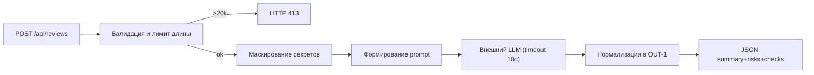

# ADR: решение для первого рабочего сценария

- Статус: proposed / accepted
- Дата: 2026-09-10
- Ответственные: Техлид (архитектура), Бэкэнд-разработчик (реализация), QA (проверки)

## Контекст

Нужно привести новый endpoint POST /api/reviews и ReviewService в соответствие с правилами Context Pack: SEC-1 (маскирование секретов), API-1 (ограничение размера входа), REL-1 (таймаут 10с и контролируемый ответ), OUT-1 (структурированный формат ответа). Сейчас сервис передаёт полный diff в LLM и возвращает поле comment, что создаёт риски утечки секретов и непригодность ответа для автоматической обработки.

## Решение

Ввести слой валидации и санации входа перед вызовом LLM, а также нормализацию ответа:
- На уровне API проверять наличие поля diff и длину (≤ 20 000), при нарушении — 422/413 соответственно.
- Перед формированием prompt пропускать diff через маскирование по паттернам секретов; в prompt использовать отредактированную версию.
- Оборачивать вызов LLM в таймаут 10 секунд; на любые ошибки возвращать контролируемый ответ, соответствующий OUT-1.
- Формировать итоговый объект с полями summary, risks (≤3, c file/line/evidence/risk), checks.

## Рассмотренные альтернативы

| Альтернатива | Почему не выбрали сейчас |
|---|---|
| Проксирование сырого ответа LLM | Нарушает OUT-1 и повышает риски качества/стабильности |
| Увеличение лимита размера diff | Ухудшает задержки и стоимость; противоречит API-1 |
| Маскирование на стороне LLM | Не гарантирует отсутствие утечек; нарушает SEC-1 |

## Последствия и главный риск

- Положительные последствия:
- Строгий контракт ответа, снижение риска утечки секретов, предсказуемая деградация при ошибках LLM.
- Ограничения: возможная потеря деталей при маскировании; отказ в обслуживании для слишком больших diff.
- Главный риск: неполное покрытие паттернов секретов и ложные срабатывания.
- Как проверим риск: тест с синтетическими секретами разных типов; аудит паттернов; мониторинг инцидентов.

## Архитектурная схема

## Как использовали AI

- Для чего: заполнение файла
- Тип промпта: master prompt
- Строка в [`prompts.md`](prompts.md): P1-04
- Что проверили и исправили сами: была ошибка компиляции в flowchart-схеме из-за скобок в тексте на ноде, взял текст в кавычки
