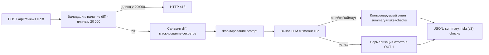

# Анализ процесса: AS IS и TO BE

## AS IS

Событие: клиент (инженер/CI) отправляет POST /api/reviews с телом {"diff": "..."}.

Текущий поток:
- API принимает тело запроса без явной валидации схемы и длины.
- API напрямую передаёт payload["diff"] в ReviewService.review.
- ReviewService формирует prompt, включающий полный diff, без маскирования секретов (SEC-1 нарушен).
- ReviewService вызывает LLM.generate и возвращает словарь {"comment": <ответ>} без нормализации под OUT-1.
- Ошибки/таймауты LLM не обрабатываются; ответ может быть несвоевременным/нестабильным (REL-1).

Участники: клиент (инженер/CI), API, ReviewService, внешний LLM.

Точки риска/задержки: утечка секретов, отсутствие лимита размера (>20 000 символов), несоответствие OUT-1, возможные таймауты. Возможный риск логирования содержимого при добавлении логов (OBS-1) — нужно контролировать.

## TO BE

После изменений: API валидирует вход и длину, возвращает 413 при превышении лимита; diff проходит санацию (маскирование секретов) перед формированием prompt; вызов LLM ограничен timeout 10 секунд; ответ нормализуется по OUT-1; при отсутствии поля diff возвращается 422.

## Разница

| Что меняется | AS IS | TO BE | Как проверим изменение |
|---|---|---|---|
| Маскирование секретов | Нет | Есть, секреты → [REDACTED] | Unit/Integration тест SEC-1 |
| Ограничение размера | Нет | 413 для >20 000 символов | Integration тест API-1 |
| Формат ответа | {comment: str} | {summary, risks[], checks[]} | Контрактные тесты OUT-1 |
| Таймаут внешнего вызова | Не определён | 10 секунд и контролируемый ответ | Интеграционный тест REL-1 |
| Валидация входа | Возможен 500 | 422 при отсутствии diff | API тест валидации |

## Как использовали AI

- Для чего: заполнение файла
- Тип промпта: master prompt
- Строка в [`prompts.md`](prompts.md): P1-04
- Что проверили и исправили сами: была ошибка компиляции в flowchart-схеме из-за скобок в тексте на ноде, взял текст в кавычки
