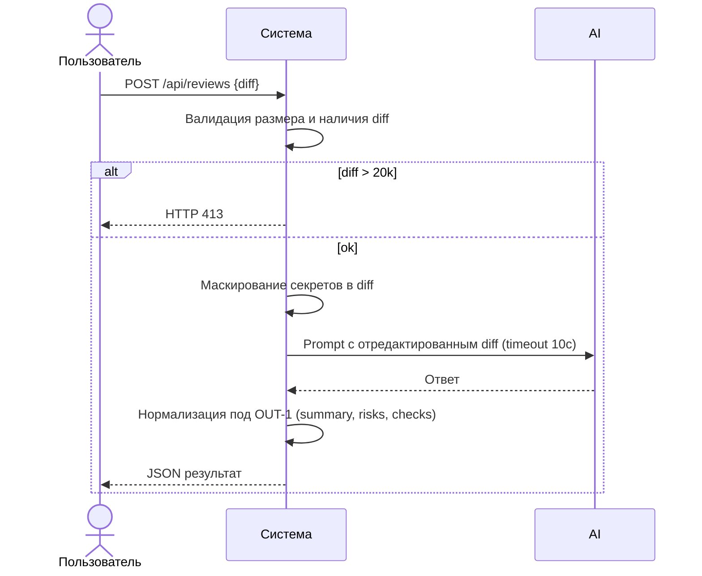

# Use cases и user stories

## Первый рабочий сценарий

**Когда** инженер или CI отправляет POST /api/reviews с корректным diff (≤ 20 000 символов), **система** валидирует вход, маскирует потенциальные секреты в diff, вызывает внешний LLM с таймаутом 10 секунд и возвращает структурированный результат по OUT-1 (summary, до 3 risks, checks), **а пользователь получает** пригодный для автоматической обработки отчёт ревью.

Не входит в этот сценарий:

- Аутентификация/авторизация, рейтлимитинг, хранение истории, интеграции с VCS/CI, изменение бизнес-логики вне SEC-1, API-1, OUT-1, REL-1.

## Use case

| Поле | Значение |
|---|---|
| Актор | Инженер-ревьюер или CI |
| Триггер | Отправка запроса POST /api/reviews с полем diff |
| Предусловия | Размер diff ≤ 20 000 символов; тело запроса содержит поле diff |
| Основной результат | Ответ JSON с полями summary, risks(≤3), checks |
| Ошибка или отказ | 413 при diff > 20 000; 422 при отсутствии diff; контролируемый ответ при таймауте LLM |



## User stories и acceptance criteria

```gherkin
Feature:
  As инженер или CI
  I want получить структурированное ревью по diff
  So that могу автоматически анализировать риски и проверки

  Scenario: Позитивный ответ по OUT-1
    Given корректный diff длиной 5000 символов
    When отправляю POST /api/reviews
    Then получаю 200 OK и JSON с полями summary, risks(<=3), checks

  Scenario: Диф слишком длинный
    Given diff длиной 20001 символ
    When отправляю POST /api/reviews
    Then получаю HTTP 413

  Scenario: Нет поля diff
    Given тело запроса без поля diff
    When отправляю POST /api/reviews
    Then получаю HTTP 422 Unprocessable Entity

  Scenario: Таймаут внешнего LLM
    Given корректный diff и LLM отвечает дольше 10 секунд
    When отправляю POST /api/reviews
    Then в течение 10 секунд получаю контролируемый ответ, соответствующий OUT-1
```

## Как использовали AI

- Для чего: заполнение файла
- Тип промпта: master prompt
- Строка в [`prompts.md`](prompts.md): P1-04
- Что проверили и исправили сами: структура файла сохранена, схемы компилируются
