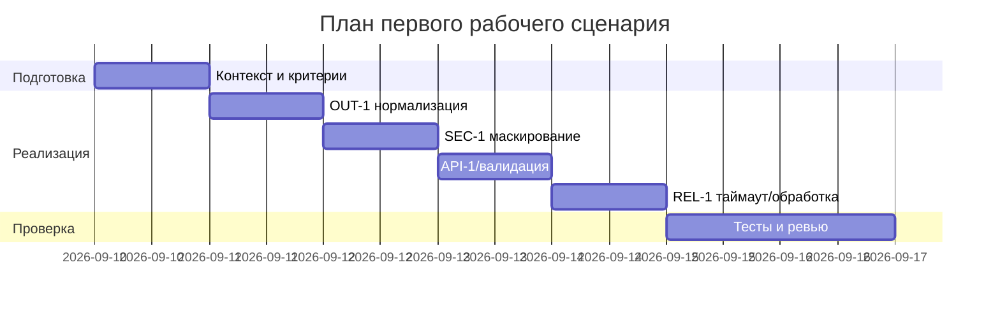

# План поставки

## Инкременты и ответственность

| Инкремент | Наблюдаемый результат | Что делает человек | Что делает AI или субагент | Проверка | Зависимости |
|---|---|---|---|---|---|
| 1 | Контракт ответа OUT-1 | Аналитик фиксирует схему OUT-1; разработчик обновляет сервисную нормализацию ответа | AI-помощник предлагает примеры схемы и маппинга | Контрактные тесты OUT-1 проходят | Context Pack OUT-1 |
| 2 | Маскирование секретов (SEC-1) | Разработчик реализует маскирование секретов в diff | AI-помощник предлагает список паттернов для маскирования | Unit/Integration тесты SEC-1 зелёные | Инкремент 1 |
| 3 | Ограничение размера и валидация | Разработчик добавляет проверку длины и schema-валидацию входа | AI-помощник формирует примеры 413/422 ответов | API тесты на 413/422 зелёные | Инкремент 1 |
| 4 | Таймаут и контролируемый ответ (REL-1) | Разработчик добавляет timeout=10с и обработку ошибок LLM | AI-помощник подсказывает шаблон обработки | Интеграционные тесты REL-1 зелёные | Инкременты 1-3 |
| 5 | Наблюдаемость по OBS-1 | Разработчик добавляет безопасные логи/метрики без содержимого diff | AI-помощник проверяет чек-лист OBS-1 | Ревью логов/метрик, аудит | Инкременты 1-4 |

## Диаграмма Ганта

Замените даты и задачи на свой план.

## Как использовали AI

- Для чего:
- Тип промпта:
- Строка в [`prompts.md`](prompts.md):
- Что проверили и исправили сами:
